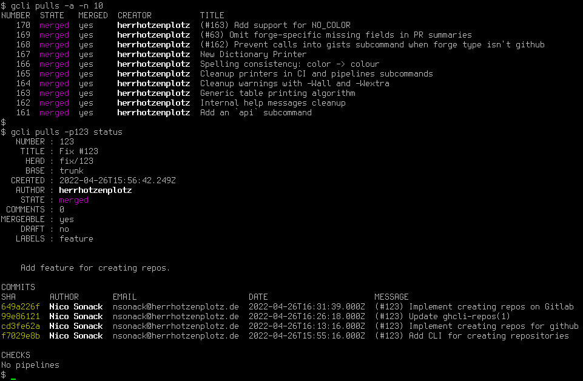

# GCLI

Simple and portable CLI tool for interacting with GitHub, GitLab and
Gitea from the command line.



## Why?

The official GitHub CLI tool only supports GitHub. I wanted a simple
unified tool for various git forges such as GitHub and GitLab because
every forge does things differently yet all build on Git and
purposefully break with its philosophy.

Also, the official tool from Github is written in Go, which does
manual [DNS
resolution](https://github.com/golang/go/blob/master/src/net/dnsclient_unix.go#L49)
which is a massive security vulnerability for people using Tor as it
leaks your IP to the DNS server. This program builds upon libcurl,
which obeys the operating system's DNS resolution mechanisms and thus
also works with Tor.

## Building

### Download

Recent tarballs can be downloaded here:

[https://herrhotzenplotz.de/gcli/releases/](https://herrhotzenplotz.de/gcli/releases/)

Please note that the tarballs provided by Github and Gitlab will not
work without you having autoconf and automake installed. So please
consider using the link above.

There are official packages available:

- [FreeBSD](https://freshports.org/devel/gcli)

Packages that are work-in-progress:

- [Debian and Devuan](https://herrhotzenplotz.de/gcli/pkg/Debian)

### Dependencies

Required dependencies:
- libcurl
- yacc (System V yacc, Berkeley Yacc or Bison should suffice)
- lex (flex is preferred)
- C99 Compiler and linker
- make

Optional dependencies:
- pkg-config

If you are building from Git you will also need:
- m4
- autoconf
- automake

The test suite requires:
- [Kyua](https://github.com/jmmv/kyua)
- [ATF](https://github.com/jmmv/atf)

### Compile
In order to perform a build, do:
```console
$ ./configure [--prefix=/usr/local]
$ make
# make [DESTDIR=/] install
```

You may leave out `DESTDIR` and `--prefix=`. The above is the default
value. The final installation destination is `$DESTDIR/$PREFIX/...`.

If you are unsure, consult the builtin configure help by running
`./configure --help`.

Also, if you are building from Git you need to generate the configure script
first:
```console
$ ./autogen.sh
```

For more details also see [HACKING.md](HACKING.md).

In case any of this does not work, please either report a bug, or
submit a patch in case you managed to fix it.

Tested Operating Systems so far:
- FreeBSD 13.0-RELEASE amd64 and arm64
- Solaris 10 and 11, sparc64
- SunOS 5.11 i86pc (OmniOS)
- Devuan GNU/Linux Chimaera x86_64
- Debian GNU/Linux ppc64, ppc64le
- Gentoo Linux sparc64, ia64
- Fedora 34 x86_64
- Haiku x86_64
- Minix 3.4.0 (GENERIC) i386
- OpenBSD 7.0 GENERIC amd64
- Alpine Linux 3.16 x86_64
- Darwin 22.2.0 arm64
- Windows 10 (mingw32-w64)
- NetBSD 9.3 amd64, sparc64 and VAX

## Support

Please refer to the manual pages that come with gcli. You may want to
start at `gcli(1)`. For further questions refer to the issues on
Github and Gitlab or ask on IRC.

## Bugs and contributions

Please report bugs, issues and questions to nsonack@herrhotzenplotz.de
or on [GitLab](https://gitlab.com/herrhotzenplotz/gcli). You can also
submit patches this way using git-send-email.

## License

BSD-2 CLAUSE (aka. FreeBSD License). Please see the LICENSE file
attached.

## Credits

This program makes heavy use of both [libcurl](https://curl.haxx.se/)
and [pdjson](https://github.com/skeeto/pdjson).

herrhotzenplotz aka. Nico Sonack
October 2021
