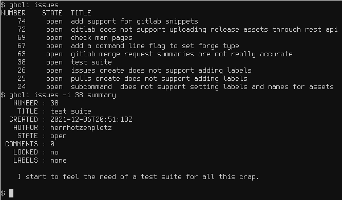

# GHCLI

Simple and portable CLI tool for interacting with GitHub and GitLab
from the command line.



## Why?

The official GitHub CLI tool only supports GitHub. I wanted a simple
unified tool for both GitHub and GitLab because every forge does
things differently yet all build on Git and purposefully break with
its philosophy.

Also, the official tool from Github is written in Go, which does
manual [DNS
resolution](https://github.com/golang/go/blob/master/src/net/dnsclient_unix.go#L49)
which is a massive security vulnerability for people using Tor as it
leaks your IP to the DNS server. This program builds upon libcurl,
which obeys the operating system's DNS resolution mechanisms and thus
also works with Tor.

## Building

Required dependencies:
- libcurl
- pkg-config
- C99 Compiler and linker
- make (bmake or smake is recommended)
  + BUG WARNING: GNU make has two longstanding bugs in the include
    directive. This may lead to it generating files in the incorrect
    order and spitting out incorrect warnings or causing builds to
    fail. You may want to use smake or bmake instead.

In order to perform a build, do:
```console
$ make
# make DESTDIR=/ PREFIX=/usr/local/ install
```

You may leave out `DESTDIR` and `PREFIX`. The above are the default
values.

In case any of this does not work, please either report a bug, or
submit a patch in case you managed to fix it. Please also try to do a
`make snmk-update`, as I sometimes update my Makefile template without
syncing it to this project. This target will pull the latest files and
rebuild the project. You will need
[cURL](https://github.com/curl/curl) for this to work.

Tested Operating Systems so far:
- FreeBSD 13.0-RELEASE amd64 and arm64
- Solaris 10 sparc64
- Devuan GNU/Linux Chimaera x86_64
- Debian GNU/Linux 5.15.5-1 ppc64
- Fedora 34 x86_64
- Haiku x86_64
- Minix 3.4.0 (GENERIC) i386

## Support

You can ask your local frenchman aka. neutaaaaan for emotional support
when using this piece of software. Otherwise you can read the man page
at »man ghcli«.

## Bugs and contributions

Please report bugs to nsonack@outlook.com or on
[GitHub](https://github.com/herrhotzenplotz/ghcli). You can also
submit patches this way using git-send-email.

## License

BSD-2 CLAUSE (aka. FreeBSD License). Please see the LICENSE file
attached.


                                     herrhotzenplotz aka. Nico Sonack
                                                         October 2021
