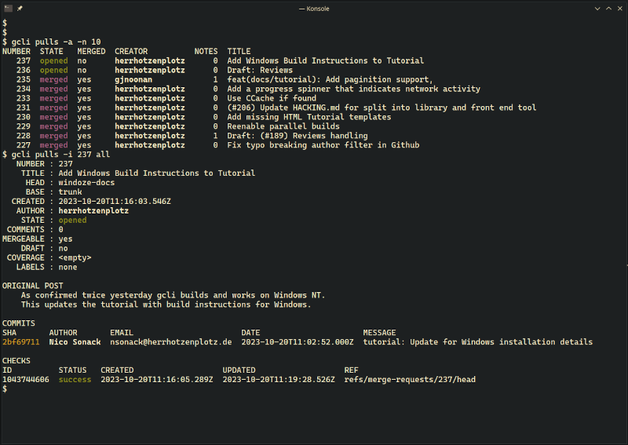

# GCLI

Portable CLI tool for interacting with Git(Hub|Lab|Tea), Forgejo and Bugzilla from the command line.



## Why?

The official GitHub CLI tool only supports GitHub.
Since I don't want to remember the commands for every single forge I wrote a tool that integrates with all of them with the same interface.

## Features

- Support for: GitHub, GitLab, Gitea, Forgejo, Bugzilla
- Manage issues, merge requests, continuous integration, releases, milestones all from the command line
- Few dependencies, portable code, support for many platforms and architectures
- Integration into version control systems: Git and GoT
- Documentation as manual pages as well as help integrated into the tool itself
- Suitable for both scripted and interactive use

## Installation

There are official packages available:

<a href="https://repology.org/project/gcli/versions">

</a>

## Building

### Download

Recent tarballs can be downloaded here:

[https://herrhotzenplotz.de/gcli/releases/](https://herrhotzenplotz.de/gcli/releases/)

### Dependencies

Required dependencies:

- libcurl
- yacc (System V yacc, Berkeley Yacc or Bison should suffice)
- lex (flex is preferred)
- C11 Compiler and linker
- make
- pkgconf or pkg-config

Optional dependencies:

- liblowdown
- libedit
- libreadline

The test suite requires:

- Perl 5 (a version that includes TAP::Harness of at least 3.48)

### Compile

In order to perform a build, do:

```console
$ ./configure [--prefix=/usr/local]
$ make
# make [DESTDIR=/] install
```

You may leave out `DESTDIR` and `--prefix=`.
The above is the default value.
The final installation destination is `$DESTDIR/$PREFIX/...`.

If you are unsure, consult the builtin configure help by running `./configure --help`.

In case any of the above does not work, please either report a bug, or submit a patch in case you managed to fix it.

Details on cross-compilation can be found in [HACKING.md](HACKING.md).

### Testing

To run the test suite first make sure you have all the necessary dependencies installed (see above).
Then you can run `make check` in the build directory to run the test suite.
Note that the check target does not allow running the tests in parallel.

For more details also see [HACKING.md](HACKING.md).

### (Previously) known to work platforms

Incomplete list of tested operating systems:

- FreeBSD (various versions) amd64, arm64 and riscv64
- Solaris 10 and 11, sparc64, SunOS 5.11 i86pc (OmniOS)
- Devuan GNU/Linux Chimaera x86_64, Debian GNU/Linux ppc64, ppc64le
- Gentoo Linux sparc64, ia64
- Fedora 34 x86_64
- Haiku x86_64
- Minix 3.4.0 (GENERIC) i386
- OpenBSD (various versions) GENERIC amd64
- NetBSD (various versions) amd64, sparc64 and VAX
- Alpine Linux 3.16 x86_64
- Darwin 22.2.0 arm64
- Windows 10 (MSYS2 mingw32-w64)

Tested Compilers so far:

- LLVM Clang (various versions)
- GCC (various versions)
- Oracle DeveloperStudio 12.6
- IBM XL C/C++ V16.1.1 (Community Edition)
- Kefir C 0.5.0

## Support / Community

Please refer to the manual pages that come with gcli.
You may want to start at `gcli(1)`.
You can also post questions on the mailing list at [https://lists.sr.ht/~herrhotzenplotz/gcli-discuss](https://lists.sr.ht/~herrhotzenplotz/gcli-discuss).

Also, there's an IRC channel #gcli on [Libera.Chat](https://libera.chat/).

## Bugs and contributions

Please report bugs, issues and questions to [~herrhotzenplotz/gcli-discuss@lists.sr.ht](mailto:~herrhotzenplotz/gcli-discuss@lists.sr.ht) or on [GitLab](https://gitlab.com/herrhotzenplotz/gcli).

You can also submit patches using git-send-email or Mercurial patchbomb to [~herrhotzenplotz/gcli-devel@lists.sr.ht](mailto:~herrhotzenplotz/gcli-devl@lists.sr.ht).

## License

BSD-2 CLAUSE (aka. FreeBSD License). Please see the LICENSE file attached.

## Credits

This program makes heavy use of both [libcurl](https://curl.haxx.se/) and [pdjson](https://github.com/skeeto/pdjson).
